<div align="center">

<!-- ═══════════════════════════════════════════════════════════════ -->
<!--  HEADER                                                         -->
<!-- ═══════════════════════════════════════════════════════════════ -->


<!-- status badges -->


[](mailto:ozairyousufi1400@gmail.com)
[](https://linkedin.com/in/ahmad-ozair-yousufi-08b469326)

</div>

---

<div align="center">
  
</div>

---

<!-- ═══════════════════════════════════════════════════════════════ -->
<!--  WHOAMI                                                         -->
<!-- ═══════════════════════════════════════════════════════════════ -->

```bash
┌──────────────────────────────────────────────────────────────────────┐
│  $ whoami                                                             │
│                                                                       │
│  > Ahmad Ozair Yousufi                                                │
│  > BSc Software Development — Staffordshire University                │
│  > Northcoders Full-Stack Bootcamp Graduate                           │
│  > Background in business: leadership baked in, not bolted on        │
│  > Backend-focused. Full-stack capable. Always learning.              │
│                                                                       │
│  $ cat /etc/principles                                                │
│                                                                       │
│  > Clarity over cleverness                                            │
│  > Test it before you ship it                                         │
│  > Ask why before asking how                                          │
│  > Write code your future self won't hate                             │
│                                                                       │
│  $ echo $AVAILABILITY                                                 │
│  > Junior SWE · Full-Stack · UK · Remote · Now                        │
│                                                                       │
└──────────────────────────────────────────────────────────────────────┘
```

---

<!-- ═══════════════════════════════════════════════════════════════ -->
<!--  ★ THE SURPRISE: npm install ahmad-yousufi                      -->
<!-- ═══════════════════════════════════════════════════════════════ -->

<div align="center">
  
</div>

---

<!-- ═══════════════════════════════════════════════════════════════ -->
<!--  WHAT I BUILD                                                    -->
<!-- ═══════════════════════════════════════════════════════════════ -->

## ⚙️ WHAT I BUILD

```
 CLIENT                     SERVER                    DATABASE
 ┌───────────┐  HTTP/REST   ┌─────────────────┐  SQL  ┌────────────┐
 │  React    │ ──────────►  │  Express.js     │ ────► │ PostgreSQL │
 │  (Vite)   │ ◄──────────  │  Node.js        │ ◄──── │ / MongoDB  │
 └───────────┘  JSON + 2xx  └────────┬────────┘  rows └────────────┘
                                     │
                      ┌──────────────┴──────────────┐
                      │       Jest Test Suite         │
                      │  unit · integration · e2e     │
                      │          ✓ all passing         │
                      └──────────────────────────────┘

  Focused on: clean routes · proper error handling · structured data
              RESTful design · meaningful tests · readable schemas
```

---

<!-- ═══════════════════════════════════════════════════════════════ -->
<!--  GIT LOG PHILOSOPHY                                             -->
<!-- ═══════════════════════════════════════════════════════════════ -->

## 📜 ENGINEERING PHILOSOPHY — `git log --oneline`

```git
a9f3c21 (HEAD -> main)  feat: write code that doesn't lie to you
7b2d4e8                  fix: understand the bug before touching it
3f1c90a                  refactor: clarity > cleverness, always
d8e2b71                  chore: ship something real, not just impressive
c14f88d                  test: if it's not tested, it doesn't work
b7a3210                  docs: future-you will thank present-you
e5d9c33 (origin/main)   init: commit to the craft, not the trend
```

---

<!-- ═══════════════════════════════════════════════════════════════ -->
<!--  LIVE SYSTEM STATUS                                             -->
<!-- ═══════════════════════════════════════════════════════════════ -->

## 📡 LIVE SYSTEM STATUS

<div align="center">
  
</div>

---

<!-- ═══════════════════════════════════════════════════════════════ -->
<!--  GITHUB STATS                                                   -->
<!-- ═══════════════════════════════════════════════════════════════ -->

## 📊 SYSTEM STATS

<div align="center">


</div>

<div align="center">
  
</div>

<div align="center">

[](https://github.com/ryo-ma/github-profile-trophy)

</div>

---

<!-- ═══════════════════════════════════════════════════════════════ -->
<!--  ACTIVITY GRAPH                                                 -->
<!-- ═══════════════════════════════════════════════════════════════ -->

## 📈 CONTRIBUTION ACTIVITY

<div align="center">

[](https://github.com/ashutosh00710/github-readme-activity-graph)

</div>

---

<!-- ═══════════════════════════════════════════════════════════════ -->
<!--  ARSENAL                                                        -->
<!-- ═══════════════════════════════════════════════════════════════ -->

## ⚡ ARSENAL

<div align="center">

**— Core Stack —**

[](https://skillicons.dev)

**— Frontend & Tooling —**

[](https://skillicons.dev)

**— Learning Actively —**

[](https://skillicons.dev)

</div>

---

<!-- ═══════════════════════════════════════════════════════════════ -->
<!--  FEATURED PROJECTS                                              -->
<!-- ═══════════════════════════════════════════════════════════════ -->

## 📌 FEATURED WORK

> Real projects. Real decisions. Real trade-offs.

<div align="center">

<a href="https://github.com/AOYousufi/my-plants-BE">
  
</a>
<a href="https://github.com/AOYousufi/my-plants-FE">
  
</a>

<a href="https://github.com/AOYousufi/NC-News-BE">
  
</a>
<a href="https://github.com/AOYousufi/NC-news-FE">
  
</a>

<a href="https://github.com/AOYousufi/Virtual-Exhibiton">
  
</a>

</div>

---

<!-- ═══════════════════════════════════════════════════════════════ -->
<!--  CURRENTLY RUNNING                                              -->
<!-- ═══════════════════════════════════════════════════════════════ -->

## 🔭 CURRENTLY RUNNING

```javascript
const Ahmad = {
  deepening:   ["Backend architecture", "REST API design patterns", "SQL optimisation"],
  exploring:   ["AI API integration", "System design", "Docker basics"],
  reading:     ["Clean Code — Robert C. Martin"],
  practicing:  ["TDD-first development", "Writing for readability"],
  building:    ["Things that work, not things that just look like they work"],

  available:   true,
  remote:      true,
  contact:     "ozairyousufi1400@gmail.com"
};

// → The code I write today should be readable by a stranger tomorrow.
```

---

<!-- ═══════════════════════════════════════════════════════════════ -->
<!--  CONTRIBUTION SNAKE                                             -->
<!-- ═══════════════════════════════════════════════════════════════ -->

## 🐍 WATCH MY COMMITS GET EATEN

<div align="center">

<picture>
  <source media="(prefers-color-scheme: dark)"
    srcset="https://raw.githubusercontent.com/AOYousufi/AOYousufi/output/github-contribution-grid-snake-dark.svg"/>
  <source media="(prefers-color-scheme: light)"
    srcset="https://raw.githubusercontent.com/AOYousufi/AOYousufi/output/github-contribution-grid-snake.svg"/>
  
</picture>

</div>

<details>
<summary><sub>🔧 Setup: add <code>.github/workflows/snake.yml</code> to generate this automatically</sub></summary>

```yaml
name: Generate Snake
on:
  schedule: [{ cron: "0 0 * * *" }]
  workflow_dispatch:
jobs:
  generate:
    runs-on: ubuntu-latest
    steps:
      - uses: Platane/snk@v3
        with:
          github_user_name: ${{ github.repository_owner }}
          outputs: |
            dist/github-contribution-grid-snake.svg
            dist/github-contribution-grid-snake-dark.svg?palette=github-dark
      - uses: crazy-max/ghaction-github-pages@v3
        with:
          target_branch: output
          build_dir: dist
        env:
          GITHUB_TOKEN: ${{ secrets.GITHUB_TOKEN }}
```
</details>

---

<!-- ═══════════════════════════════════════════════════════════════ -->
<!--  CONTRIBUTION ARCADE                                            -->
<!-- ═══════════════════════════════════════════════════════════════ -->

## 🎮 CONTRIBUTION ARCADE — BREAK MY COMMITS

> *Every block is a commit. Try harder.*

<div align="center">

<picture>
  <source media="(prefers-color-scheme: dark)"
    srcset="https://raw.githubusercontent.com/AOYousufi/AOYousufi/github-breakout/images/breakout-dark.svg"/>
  <source media="(prefers-color-scheme: light)"
    srcset="https://raw.githubusercontent.com/AOYousufi/AOYousufi/github-breakout/images/breakout-light.svg"/>
  
</picture>

</div>

---

<!-- ═══════════════════════════════════════════════════════════════ -->
<!--  CONTACT                                                        -->
<!-- ═══════════════════════════════════════════════════════════════ -->

## 📬 HIRE ME — OR JUST SAY HI

<div align="center">

```
If you need someone who:
  ✓ writes code that doesn't need explaining the next day
  ✓ asks why before how
  ✓ ships things that actually work under pressure
  ✓ grows fast and stays humble doing it

→ That's me. Drop me a message.
```

<br/>

[](mailto:ozairyousufi1400@gmail.com)
&nbsp;&nbsp;
[](https://github.com/AOYousufi)
&nbsp;&nbsp;
[](https://linkedin.com/in/ahmad-ozair-yousufi-08b469326)

<br/>

*Junior SWE · Full-Stack · UK · Remote · Available now*

<br/>


</div>

<!-- ═══════════════════════════════════════════════════════════════ -->

